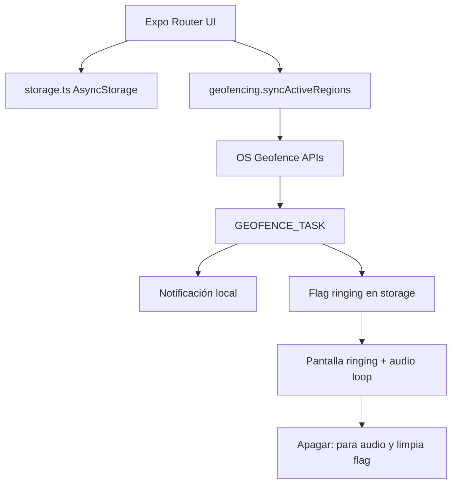
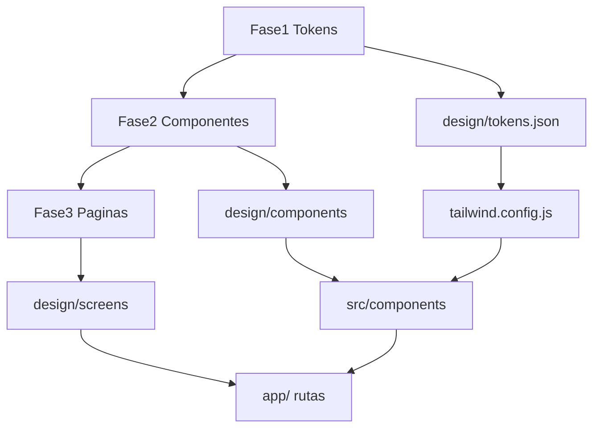

# Plan: Arrivo (MVP geofencing offline)

Diseñar en Penpot en tres capas (tokens → componentes → páginas) y luego implementar Arrivo en Expo: geofencing local, i18n es/en, NativeWind alineado al sistema de diseño, CRUD, mapa y alarma persistente.

El workspace está vacío (salvo `EntryPrompt.md`). **Primero se diseña en Penpot en tres fases (tokens → componentes → páginas)**; el código no empieza hasta exportar esas tres capas al repo. Luego `create-expo-app` (Expo Router + TypeScript) e implementación del MVP.

**Decisiones fijadas**

- Diseño: **Penpot** (cloud gratis o self-host, coste $0) como fuente de verdad de UI. 21st.dev solo como referencia opcional de componentes, no como archivo de diseño.
- Estilos en código: **NativeWind** mapeado 1:1 a tokens Penpot.
- UI: **i18n es/en** (en Penpot, duplicar copy clave o usar capas `ES` / `EN` en los frames críticos).
- Disparo: **entrada** al geofence (al adentrarse en el radio), no salida.
- Nombre de app: **Arrivo** (`slug`: `arrivo`).

**Restricción crítica de Expo:** geofencing, ubicación en background y MapLibre **no funcionan en Expo Go**. Hará falta un **development build** (`npx expo run:ios` / `run:android` o EAS). El mapa usa **OpenStreetMap** vía MapLibre + OpenFreeMap (vector tiles, sin API key ni cupo mensual).

---

## Tareas

- [ ] Penpot fase 1: tokens (color light/dark, tipo, tamaños, spacing, radii, elevación, paleta de radios)
- [ ] Penpot fase 2: componentes reutilizables con variantes/estados, solo a partir de tokens
- [ ] Penpot fase 3: páginas/flujos ensamblando componentes (onboarding, lista, editor, mapa, ringing)
- [ ] Exportar `design/` y mapear tokens Penpot a `tailwind.config.js` + `DESIGN.md`
- [ ] Inicializar Expo Router + TypeScript, NativeWind, `app.json`/plugins y i18n es/en
- [ ] Tipos, AsyncStorage y pantallas lista/crear/editar/eliminar con toggle
- [ ] Pantalla mapa: tap, Circle, slider radio, color, Nominatim
- [ ] Onboarding pedagógico `LOCATION_FOREGROUND` / `LOCATION_BACKGROUND` + `NOTIFICATIONS`
- [ ] TaskManager + `startGeofencingAsync` + notificaciones + audio loop + `/ringing`
- [ ] README: development build, OSM/MapLibre (sin API key), límite 20 geofences

---

## Arquitectura de carpetas

```
Arrivo/
  Docs/
    plan.md
  design/
    DESIGN.md                 # enlace Penpot + cómo usar las 3 capas
    tokens.json               # fase 1
    components/               # inventario + PNG de cada componente (fase 2)
    screens/                  # PNG de cada página light/dark (fase 3)
  app/
    _layout.tsx                 # Root: TaskManager import, providers, tema
    index.tsx                   # Lista de alarmas
    alarm/[id].tsx              # Crear / editar (id = "new" | uuid)
    map-picker.tsx              # Selector de ubicación
    ringing.tsx                 # Pantalla Apagar alarma
    onboarding.tsx              # Información: permisos + guía de uso
  src/
    components/                 # AlarmCard, ColorSwatch, RadiusSlider, PermissionStep, ...
    hooks/                      # useAlarms, usePermissions, useColorScheme
    i18n/                       # en.ts, es.ts, index.ts (expo-localization)
    services/
      storage.ts                # AsyncStorage CRUD
      geofencing.ts             # sync regiones activas
      notifications.ts          # canal Android HIGH + local notif
      alarmAudio.ts             # expo-audio loop hasta dismiss
    tasks/
      geofencingTask.ts         # defineTask (scope global)
    types/alarm.ts
    constants/                   # radios, paleta de colores, task name
  assets/sounds/alarm.wav
  app.json / app.config.ts
  global.css                    # NativeWind
  tailwind.config.js
  metro.config.js
```



---

## Fase 0 — Diseño en Penpot (antes de código)

Tres capas en orden estricto. No se dibujan páginas hasta tener componentes; no se dibujan componentes con colores/tamaños sueltos: solo tokens. En código, la misma pirámide: `tailwind.config` ← componentes RN ← rutas Expo.



Referencia opcional: [21st.dev](https://21st.dev) para inspirar variantes de un componente, sin saltarse tokens ni copiar sistemas web-only.

### Fase 1 — Tokens

Página Penpot `01-Tokens`. Un único set semántico (light + dark), no hex sueltos en frames.

- **Color:** `bg`, `surface`, `surface-elevated`, `text`, `text-muted`, `border`, `brand`, `danger` (alarma), `success`, overlay; **paleta cerrada de radios** (6–8 swatches para el círculo del mapa).
- **Tipografía:** familia, pesos, escala (`display`, `title`, `body`, `caption`, `button`) con line-height.
- **Tamaño / spacing:** grid 4pt (`space-1` … `space-16`), iconos (16/20/24), alturas de toque mín. 44pt.
- **Radii, stroke, elevación/sombra,** opacidad (disabled, overlay).
- **Motion (opcional MVP):** duración `fast` / `normal`.

Entregable: `design/tokens.json` + sección en `DESIGN.md`. Done cuando NativeWind puede mapear cada token sin valores mágicos.

### Fase 2 — Componentes

Página Penpot `02-Componentes`. Cada uno es un símbolo/componente con auto-layout, **solo tokens**, variantes y estados. Inventario MVP:

| Componente | Variantes / estados |
|------------|---------------------|
| Button | primary, secondary, danger, ghost; default / pressed / disabled |
| IconButton | default / pressed |
| FAB | default / pressed |
| TextField / SearchBar | empty, filled, focused, error |
| Switch | on / off / disabled |
| AlarmCard | active, inactive, compact |
| ColorSwatch | selected / unselected |
| RadiusSlider | con label de metros |
| PermissionStep | pending, granted, denied |
| EmptyState | ilustración + título + CTA |
| MapPreview / RadiusCircle | color de paleta + radio |
| StopAlarmButton | idle / pressed (énfasis danger) |
| AppBar / Nav title | default |
| ListSeparator / Badge | — |

Done: ningún elemento de página se dibuja “a mano” si ya existe en esta librería; cada componente tiene espec de props equivalente a RN.

### Fase 3 — Páginas

Página Penpot `03-Paginas`. Frames **390×844** (y opcional Android). Light y dark. **Solo instancias de la fase 2.** Flujos:

- **Onboarding:** 3 pasos (ubicación uso → siempre → notificaciones) + denegado.
- **Lista:** con datos, vacía (`EmptyState`), hint de alarma.
- **Editor** crear/editar (título, slider, swatches, `MapPreview`).
- **Map picker:** `SearchBar` + mapa + círculo + confirmar.
- **Ringing:** título + mapa + `StopAlarmButton` (sin back).
- **Mock notificación** local (copy es/en).

Estados extra: lista 0 items, permiso denegado, 20 geofences (aviso). Copy en capas ES/EN o frame duplicado.

Entregable: `design/screens/{light,dark}/*.png`. Done: las 5 rutas Expo tienen página light+dark ensamblada con componentes, no con formas sueltas.

**Criterio de done de diseño (las 3 fases):** tokens exportados; librería de componentes completa; páginas = composición; paleta de radios cerrada.

---

## Configuración (`app.json` / plugins)

Plugins y permisos necesarios:

- `expo-router`, `expo-location`, `expo-notifications`, `expo-task-manager`, `expo-audio`, `expo-localization`, `@maplibre/maplibre-react-native`
- iOS `infoPlist`: `NSLocationWhenInUseUsageDescription`, `NSLocationAlwaysAndWhenInUseUsageDescription`, `NSLocationAlwaysUsageDescription`, `UIBackgroundModes`: `location`, `audio`, `fetch`
- `ios.infoPlist.UIBackgroundModes` + `isIosBackgroundLocationEnabled` en el plugin de `expo-location`
- Android: `ACCESS_FINE_LOCATION`, `ACCESS_COARSE_LOCATION`, `FOREGROUND_SERVICE`, `FOREGROUND_SERVICE_LOCATION`, `FOREGROUND_SERVICE_MEDIA_PLAYBACK`, `POST_NOTIFICATIONS`, `RECEIVE_BOOT_COMPLETED`. **No** `ACCESS_BACKGROUND_LOCATION` (FGS tipo `location` + notificación «Arrivo activo»).
- Plugin `@maplibre/maplibre-react-native` (OpenStreetMap / OpenFreeMap; sin Google Maps ni API key)

Límite de plataforma a respetar en código: **máx. 20 geofences activos** (iOS). Si hay más alarmas activas, avisar y no registrar las restantes.

---

## Modelo y persistencia

Tipo único en `src/types/alarm.ts`:

```ts
export type GeoAlarm = {
  id: string;
  title: string;
  latitude: number;
  longitude: number;
  radius: number; // 100–5000
  color: string;  // hex de paleta
  isActive: boolean;
  createdAt: number;
  updatedAt: number;
};
```

`src/services/storage.ts`: clave `alarms`, `ringingAlarmId`. API: `getAlarms`, `upsertAlarm`, `deleteAlarm`, `setAlarmActive`, `getRingingAlarmId`, `setRingingAlarmId`. Tras cada mutación que cambie activas, llamar a `syncGeofences()`.

---

## Geofencing, notificaciones y audio

`src/tasks/geofencingTask.ts` (importado **sí o sí** desde `app/_layout.tsx`):

- `TaskManager.defineTask('ARRIVO_GEOFENCE', ...)`
- En evento `ENTER`: resolver alarma por `region.identifier === alarm.id`, ignorar inactivas, `setRingingAlarmId`, programar notificación local (Android channel `alarm` importance `MAX`, sonido, `sticky` si es posible).
- `Location.startGeofencingAsync` con regiones `{ identifier, latitude, longitude, radius, notifyOnEnter: true, notifyOnExit: false }`.

Limitación honesta a manejar en UX: con la app **muerta**, el SO entrega el evento y la notificación; el **loop de `expo-audio` solo arranca de forma fiable cuando el proceso está vivo** (foreground o al abrir desde la notificación). Flujo:

1. Background: notificación alta prioridad.
2. Al abrir la app / tap en notificación: deep link a `/ringing`, `Audio.Sound` con `isLooping: true` hasta "Apagar alarma".
3. Apagar no desactiva el geofence (el re-disparo exige salir y volver a entrar).

---

## Pantallas (Expo Router)

| Ruta | Comportamiento |
|------|----------------|
| `/onboarding` | Pestaña permisos (ubicación uso → siempre en iOS → notificaciones) y pestaña cómo usar. Textos pedagógicos i18n. |
| `/` | Lista, switch activo, swipe/delete, FAB crear. Vacío ilustrado. |
| `/alarm/[id]` | Título, slider radio, paleta de color, preview mini-mapa, botón elegir ubicación. |
| `/map-picker` | MapLibre (OSM) tap → marker + polígono de radio del color elegido; Nominatim en buscador. |
| `/ringing` | Título, mapa, botón grande Apagar. Bloquea back hasta dismiss. |

Dark Mode: `className` NativeWind + `useColorScheme`; paleta **solo** la de Penpot en `tailwind.config.js` (`dark:`). No introducir colores ad hoc en pantallas.

i18n ligero: `expo-localization` + diccionarios `src/i18n/{en,es}.ts` y contexto `I18nProvider` (sin backend).

---

## Dependencias principales

`expo-location`, `expo-task-manager`, `expo-notifications`, `expo-audio`, `expo-localization`, `@maplibre/maplibre-react-native`, `@react-native-async-storage/async-storage`, `nativewind`, `tailwindcss`, `react-native-reanimated` (si lo pide NativeWind v4).

Sonido: incluir un `.wav` corto en `assets/sounds/` (loop); documentar que el usuario puede sustituirlo.

---

## Fuera de alcance del MVP (ideas para más adelante)

No implementar ahora: repetición por días, Wi‑Fi como trigger, iCloud/backup, Apple Watch, geofences > 20 con agrupación. Sí dejar el storage/servicios desacoplados para ampliar.

---

## Orden de implementación

0. **Penpot fase 1:** tokens (color, tipo, tamaños, spacing, radii).
1. **Penpot fase 2:** componentes reutilizables y variantes.
2. **Penpot fase 3:** páginas composadas; exportar `design/` y `DESIGN.md`.
3. Mapear tokens → NativeWind; scaffolding Expo + i18n + plugins.
4. Implementar `src/components` 1:1 con la librería Penpot; luego lista CRUD.
5. Map picker + formulario (círculo = tokens de paleta/radio).
6. Onboarding según páginas Penpot.
7. Task geofencing + notificaciones + `/ringing` + audio.
8. README: Penpot (3 fases), development build, OSM/MapLibre (OpenFreeMap, sin API key), límite 20 geofences.

