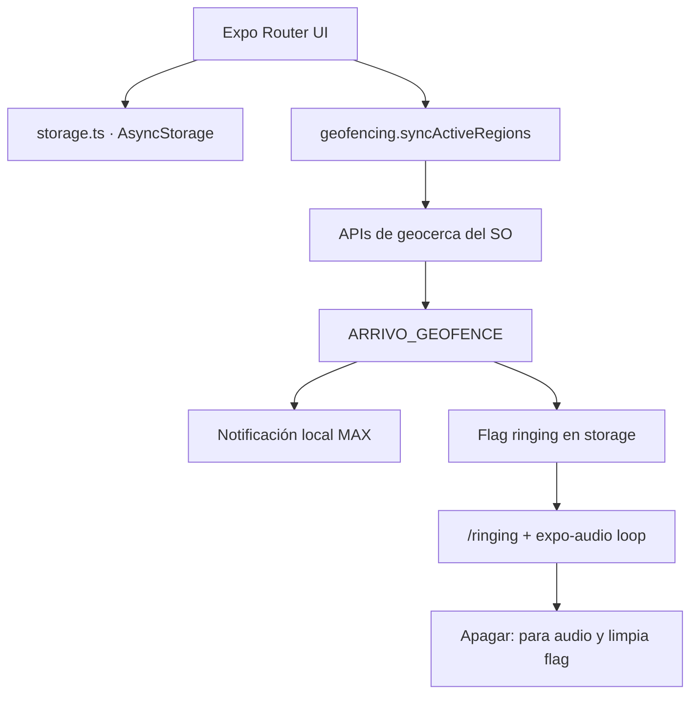
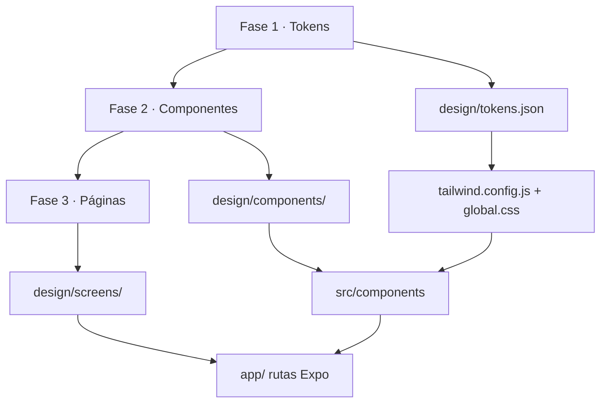

# Arrivo

[](https://docs.expo.dev/)
[](https://www.typescriptlang.org/)
[](#2-restricciones-t%C3%A9cnicas-cr%C3%ADticas--development-builds)
[](#2-restricciones-t%C3%A9cnicas-cr%C3%ADticas--development-builds)
[](#3-openstreetmap--nominatim)
[](#1-descripci%C3%B3n-del-proyecto--arquitectura-de-dise%C3%B1o)

Alarmas de lugar para iOS y Android: **cuando entras en el radio de un destino guardado, la app te avisa**. El disparo es local (geocercas del sistema operativo), sin cuenta, sin backend y sin API keys de mapas.

| | |
|---|---|
| **Nombre** | Arrivo |
| **Slug** | `arrivo` |
| **Bundle / package** | `com.arrivo.app` |
| **Scheme** | `arrivo://` |
| **GitHub** | [github.com/sarroyomart/Arrivo](https://github.com/sarroyomart/Arrivo) |
| **Stack** | Expo Router · TypeScript · NativeWind v4 · AsyncStorage |
| **Plan de producto** | [`Docs/plan.md`](Docs/plan.md) |
| **Sistema de diseño** | [`design/DESIGN.md`](design/DESIGN.md) · [`design/tokens.json`](design/tokens.json) |

```bash
git clone https://github.com/sarroyomart/Arrivo.git
```

> **No uses Expo Go.** Geofencing, ubicación en segundo plano, MapLibre y el sonido de alarma nativo requieren un **development build**. Ver [sección 2](#2-restricciones-técnicas-críticas--development-builds).

---

## Tabla de contenidos

1. [Descripción del proyecto y arquitectura de diseño](#1-descripción-del-proyecto--arquitectura-de-diseño)
2. [Restricciones técnicas y development builds](#2-restricciones-técnicas-críticas--development-builds)
3. [OpenStreetMap y Nominatim](#3-openstreetmap--nominatim)
4. [Límites de plataforma y reglas de negocio](#4-límites-de-plataforma-y-reglas-de-negocio)
5. [Guía de pruebas de geofencing](#5-guía-de-pruebas-de-geofencing)
6. [Personalización de assets y estructura del repo](#6-personalización--estructura-del-repositorio)
7. [Pantallas](#pantallas)
8. [Fuera de alcance del MVP](#fuera-de-alcance-del-mvp)

---

## 1. Descripción del proyecto y arquitectura de diseño

### Qué es Arrivo

Arrivo es un MVP de **alarmas por ubicación (geofencing offline)**:

- Creas un destino (título, coordenadas, radio 100–5000 m, color de zona).
- El sistema operativo vigila esa geocerca aunque la app esté en segundo plano.
- Al **entrar** en el radio (`ENTER`), se programa una notificación local de máxima prioridad, se guarda un flag `ringingAlarmId` y, al abrir la app o tocar la notificación, se entra en `/ringing` con un **loop de audio** hasta que pulsas **Apagar alarma**.
- La ubicación **no se envía a ningún servidor nuestro**. AsyncStorage vive en el dispositivo. Nominatim solo se usa si buscas una dirección (geocodificación opcional).



### Flujo de diseño Penpot (3 fases)

La UI no se improvisa en código. Penpot es la fuente de verdad, en **pirámide estricta**:



| Fase | Entregable | En el repo |
|------|------------|------------|
| **1 · Tokens** | Color (light/dark), tipo Inter, grid 4 pt, radii, sombra, paleta de zona (6 swatches) | [`design/tokens.json`](design/tokens.json) |
| **2 · Componentes** | Símbolos con variantes (Button, AlarmCard, MapPreview, StopAlarmButton, …) **solo con tokens** | Implementados en [`src/components/`](src/components/); inventario Penpot en [`design/DESIGN.md`](design/DESIGN.md) |
| **3 · Páginas** | Frames 390×844 light/dark: onboarding, lista, editor, map picker, ringing | Rutas en [`app/`](app/); exports SVG en [`design/screens/`](design/screens/) |

Cómo usar las tres capas: **[`design/DESIGN.md`](design/DESIGN.md)**.

### Tokens → NativeWind v4 (1:1)

Los hex de Penpot se exponen como variables CSS en [`global.css`](global.css) (light en `:root`, dark en `.dark`) y se mapean a clases semánticas en [`tailwind.config.js`](tailwind.config.js). Las pantallas **no usan hex sueltos**.

| Token Penpot | Clase NativeWind | Uso |
|--------------|------------------|-----|
| `color.canvas` | `bg-canvas` | Fondo de pantalla |
| `color.card` | `bg-card` | Superficies / sheets |
| `md.sys.color.primary` | `bg-brand` / `bg-primary` | CTA, switch, acento |
| `color.danger` / `danger-soft` | `bg-danger` / `bg-danger-soft` | Apagar alarma, `/ringing` |
| `color.foreground` / `muted` | `text-foreground` / `text-muted` | Texto |
| `color.zone-*` | `bg-zone-orange` … `bg-zone-slate` | Paleta cerrada del círculo |
| `font.size.display` | `typo-display` | Títulos grandes |
| `space.*` (4 pt) | `p-space-4`, `mt-space-6`, … | Espaciado |
| `radii.card` / `pill` | `rounded-card` / `rounded-pill` | Radios |

Dark mode: `userInterfaceStyle: "automatic"` + `ThemeProvider` (clase `.dark` de NativeWind). Los mapas nativos que necesitan un hex (círculo, StatusBar) leen [`src/constants/palette.ts`](src/constants/palette.ts), que replica los mismos tokens.

---

## 2. Restricciones técnicas críticas y development builds

### Por qué no funciona en Expo Go

Expo Go es una sandbox **ya compilada**. Arrivo necesita módulos nativos que **no están** (o no están completos) en esa app:

| Capacidad | Módulo | Por qué falla en Expo Go |
|-----------|--------|---------------------------|
| Geofencing + background | `expo-location` + `expo-task-manager` | `startGeofencingAsync` y tareas en background exigen el binario de la app |
| Mapa vectorial OSM | `@maplibre/maplibre-react-native` | Librería nativa; no viene en Expo Go |
| Canal de alarma + `.wav` custom | `expo-notifications` plugin | El sonido se copia al proyecto nativo en prebuild |
| Loop en background | `expo-audio` + `UIBackgroundModes: audio` | Hay que compilar el Info.plist / manifest |

Hay que generar **tu propia app** (development client) con esos plugins. El JS sigue recargando en caliente; solo recompilas nativo si cambias `app.json`, plugins o assets nativos (p. ej. `alarm.wav`).

### Requisitos previos

| Herramienta | Para |
|-------------|------|
| **Node.js 20 LTS** (o superior compatible con Expo 57) | `npm install`, Metro |
| **Xcode** + simulador o iPhone | iOS (`npx expo run:ios`) |
| **CocoaPods** (macOS) | Dependencias nativas iOS (`sudo gem install cocoapods` o vía Homebrew) |
| **Android Studio** + SDK + emulador o dispositivo USB | Android (`npx expo run:android`) |
| Cuenta Apple (iPhone físico) / depuración USB (Android físico) | Firmar e instalar el development build |

Este repo ya incluye `expo-dev-client`, los plugins de ubicación/notificaciones/audio y [`eas.json`](eas.json).

### Compilación local

```bash
# 1. Dependencias JS
npm install

# 2. Generar proyectos nativos (ios/ y android/) a partir de app.json
npx expo prebuild

# 3a. iOS — requiere Mac + Xcode
npx expo run:ios

# 3b. Android — requiere Android Studio / emulador / dispositivo
npx expo run:android
```

La **primera** compilación tarda varios minutos. Después, en el día a día:

```bash
npx expo start --dev-client
```

Abre la app **Arrivo** (no Expo Go) y conéctala al bundler. Vuelve a `run:ios` / `run:android` solo si cambias código nativo o plugins.

Atajos del `package.json`:

```bash
npm run ios       # expo run:ios
npm run android   # expo run:android
npm run start     # expo start --dev-client
npm run prebuild  # expo prebuild
```

### Compilación remota (EAS Build)

Si no quieres instalar Xcode/Android Studio en esta máquina:

```bash
npm install -g eas-cli
eas login
eas build --profile development --platform all
```

El perfil `development` en [`eas.json`](eas.json) (`developmentClient: true`, `distribution: "internal"`) produce un cliente instalable con hot reload. Instala el artefacto en el dispositivo y ejecuta `npx expo start --dev-client`.

| Perfil EAS | Uso |
|------------|-----|
| `development` | Development client interno (este MVP) |
| `preview` | Build interno sin dev client |
| `production` | Store / AAB (`autoIncrement`, `buildType: app-bundle`, sin `developmentClient`) |

---

## 3. OpenStreetMap y Nominatim

**Cero API keys de Google Maps, Mapbox o similares. Cero facturación externa para el mapa.**

| Capa | Tecnología | Dónde |
|------|------------|--------|
| Mapa interactivo (home, map picker, preview) | MapLibre + teselas vectoriales **OpenFreeMap** | [`src/components/OsmMap.tsx`](src/components/OsmMap.tsx) · estilos en [`src/constants/map.ts`](src/constants/map.ts) |
| Búsqueda / reverse geocode | **Nominatim** (OpenStreetMap) | [`src/services/nominatim.ts`](src/services/nominatim.ts) |

Atribución en UI: `© OpenStreetMap contributors` (enlace a [osm.org/copyright](https://www.openstreetmap.org/copyright)). MapLibre pinta también su atribución nativa. No hay teselas ráster ni `react-native-maps`.

### Teselas vectoriales (OpenFreeMap)

El mapa usa estilos sin clave:

- Light: `https://tiles.openfreemap.org/styles/positron`
- Dark: `https://tiles.openfreemap.org/styles/dark`

### Nominatim

Búsqueda (solo al pulsar buscar, no a cada tecla) y reverse geocoding contra Nominatim, con:

- Header **`User-Agent: Arrivo/1.0 (https://github.com/sarroyomart/Arrivo; …/issues)`** y `Referer` (política de [Nominatim](https://operations.osmfoundation.org/policies/nominatim/))
- `Accept-Language` según el locale del dispositivo
- Throttle de **1 petición / segundo**, caché en memoria y timeout de 8 s
- Endpoint configurable en [`config/geocoder.json`](config/geocoder.json) (la app lo lee en remoto al arrancar para poder cambiar de servidor sin actualizar la store)

La geocodificación es **opcional** (caja de búsqueda). Las alarmas y el geofencing funcionan sin red una vez guardadas las coordenadas. El mapa y Nominatim sí usan Internet.

Para cambiar teselas, edita [`src/constants/map.ts`](src/constants/map.ts). Para cambiar el geocoder, edita `config/geocoder.json` (y súbelo al repo).

---

## 4. Límites de plataforma y reglas de negocio

### Límite de 20 geocercas activas

iOS permite **como máximo 20 regiones** monitoreadas a la vez por app (`CLLocationManager`). Android admite más, pero el MVP unifica el techo en **20** para no divergir.

| Capa | Comportamiento |
|------|----------------|
| UI · [`useAlarms`](src/hooks/useAlarms.ts) | Si activar/crear superaría 20, lanza `GeofenceLimitError` y se muestra el aviso i18n `geofenceLimit.*` |
| Sync · [`syncActiveRegions`](src/services/geofencing.ts) | Si hubiera más de 20 activas, registra las **primeras 20** y deja un `console.warn` |
| Constante | `MAX_ACTIVE_GEOFENCES = 20` en [`src/constants/geofencing.ts`](src/constants/geofencing.ts) |

Desactivar otra alarma libera un hueco. Las inactivas **no** cuentan: siguen en AsyncStorage pero no se registran en el SO.

### Mecánica de disparo (`ENTER`)

Las regiones se registran así:

```ts
{
  identifier: alarm.id,
  latitude,
  longitude,
  radius,
  notifyOnEnter: true,
  notifyOnExit: false,
}
```

La tarea global `ARRIVO_GEOFENCE` ([`src/tasks/geofencingTask.ts`](src/tasks/geofencingTask.ts), importada en [`app/_layout.tsx`](app/_layout.tsx)) solo actúa si:

1. El evento es `Location.GeofencingEventType.Enter`
2. Existe la alarma y `isActive === true`

**Apagar la alarma no borra la geocerca.** Solo para el audio y pone `ringingAlarmId` a `null`. El SO sigue vigilando. Un nuevo disparo exige **salir del radio y volver a entrar**.

### Notificación + audio

Limitación honesta del SO / Expo:

| Estado de la app | Qué ocurre |
|------------------|------------|
| Segundo plano o muerta | El SO entrega el `ENTER` y se muestra una **notificación local** de prioridad máxima (canal Android `arrivo_alarm_channel`, importancia `MAX`, sonido `alarm.wav`, vibración, `AndroidAudioUsage.ALARM`). El loop de `expo-audio` **no es fiable** con el proceso muerto. |
| Tap en la notificación, o abrir la app con flag | Deep link / `router.replace` a `/ringing?id=…` |
| `/ringing` montada | `startAlarmAudio()`: `playsInSilentModeIOS`, `staysActiveInBackground`, `isLooping: true` hasta **Apagar alarma** |
| App ya en primer plano al entrar | La notificación llega y el layout redirige a `/ringing` para que suene el loop |

Canal Android: id `arrivo_alarm_channel`, nombre i18n **Alarmas de Ubicación** / **Location Alarms**. Tras cambiar el `.wav` hay que **recompilar** el development build (el plugin de `expo-notifications` copia el archivo al proyecto nativo).

---

## 5. Guía de pruebas de geofencing

Haz siempre un **development build**. En Expo Go no verás el `ENTER`.

### Preparación común

1. Completa el onboarding (pestaña Permisos: ubicación *mientras usas* → notificaciones; en iOS también *siempre*). La pestaña Cómo usar resume el flujo de la app.
2. Crea una alarma con un radio **pequeño** (p. ej. 100–200 m) en un punto conocido.
3. **Empieza fuera** de la zona. iOS/Android disparan `ENTER` en la **transición** fuera → dentro. Si simulas coordenadas ya *dentro*, es posible que no suene nada.
4. Deja la app en segundo plano (o mátala) para probar notificación; ábrela / toca la notificación para el loop de audio.

### Simulador iOS (Xcode)

1. `npx expo run:ios` y deja el simulador en marcha.
2. En el menú del **Simulator**: **Features → Location**.
   - **Custom Location…** para fijar lat/lng fuera del radio.
   - Luego otra custom location **dentro** del radio, o usa **City Run** / **Freeway Drive** para un recorrido.
3. Desde **Xcode** (con el scheme de `arrivo` seleccionado): **Debug → Simulate Location** y elige una ciudad o un GPX.

**Archivo `.gpx` de ejemplo** (fuera → dentro). Guárdalo y simúlalo desde Xcode:

```xml
<?xml version="1.0"?>
<gpx version="1.1" creator="Arrivo">
  <wpt lat="40.4168" lon="-3.7038"><name>Fuera</name></wpt>
  <wpt lat="40.4170" lon="-3.7038"><name>Dentro</name></wpt>
</gpx>
```

Ajusta las coordenadas al pin de tu alarma. El geofencing del simulador puede tardar unos segundos; no esperes un disparo al instante.

### Emulador Android

1. `npx expo run:android`.
2. Abre **Extended controls** (⋯) → **Location**.
3. Introduce latitud/longitud **fuera** del radio → **Send** / **Set location**.
4. Cambia a un punto **dentro** del radio → **Send** de nuevo.

En un dispositivo físico, GPX / apps de simulación de ubicación o un desplazamiento real son más representativos que el emulador.

### Qué debes ver

| Paso | Resultado esperado |
|------|--------------------|
| `ENTER` con app en background | Notificación: *¡Has llegado a tu destino!* / *Estás dentro del radio de {título}* |
| Tap en la notificación | Abre `/ringing`, mapa estático, audio en bucle |
| Abrir la app desde el launcher con flag pendiente | Redirección automática a `/ringing` |
| **Apagar alarma** | Audio off, vuelves a `/`, la alarma **sigue activa** |
| Seguir dentro del radio | No se re-dispara hasta salir y volver a entrar |

---

## 6. Personalización y estructura del repositorio

### Sonido de la alarma

El loop y la notificación usan el mismo archivo:

```
assets/sounds/alarm.wav
```

Para sustituirlo:

1. Reemplaza `assets/sounds/alarm.wav` (WAV corto, pensado para loop; evita MP3 largos).
2. Si cambias el **nombre** del archivo, actualiza:
   - `expo.plugins` → `expo-notifications.sounds` en [`app.json`](app.json)
   - `ANDROID_ALARM_SOUND` en [`src/constants/geofencing.ts`](src/constants/geofencing.ts)
3. Vuelve a generar nativo: `npx expo prebuild` y `npx expo run:ios` / `run:android` (o un EAS development build). **Metro solo no basta.**

### Mapa / teselas

| Qué cambiar | Archivo |
|-------------|---------|
| URL de estilos MapLibre (claro/oscuro) | `OSM_STYLE_URL` en [`src/constants/map.ts`](src/constants/map.ts) |
| Endpoint Nominatim / `User-Agent` | [`src/services/nominatim.ts`](src/services/nominatim.ts) |

Mantén la atribución OSM en el mini-mapa.

### Estructura del repositorio

Alineada con [`Docs/plan.md`](Docs/plan.md). Módulos extra respecto al plan (`nominatim.ts`, `utils/`, prebuild `android/`) cubren geocodificación, helpers y el development build.

```
Arrivo/
├── Docs/
│   ├── plan.md                 # Producto, arquitectura y orden de implementación
│   ├── privacy-policy.md       # Política pública (URL de Play)
│   ├── play-console.md         # Textos Data Safety / FGS / FSI
│   └── EntryPrompt.md
├── design/
│   ├── DESIGN.md               # Penpot: 3 fases, tokens MD3, consumo NativeWind
│   ├── tokens.json             # Fase 1 exportada
│   └── screens/                # Exports fase 3 (SVG dashboard / configurar-alarma)
├── app/                        # Expo Router
│   ├── _layout.tsx             # Import de la task, providers, redirect ringing
│   ├── index.tsx               # Lista CRUD + toggle
│   ├── alarm/[id].tsx          # Crear / editar
│   ├── map-picker.tsx          # Mapa OSM interactivo
│   ├── ringing.tsx             # Alarma sonando (sin back)
│   ├── onboarding.tsx          # Información: permisos + guía de uso
│   ├── privacy.tsx             # Política de privacidad in-app
│   └── licenses.tsx            # Licencias OSS + NOTICE Apache
├── src/
│   ├── components/             # Librería 1:1 con Penpot (Button, AlarmCard, …)
│   ├── hooks/                  # useAlarms, usePermissions, useColorScheme
│   ├── i18n/                   # es.ts / en.ts + I18nProvider
│   ├── services/
│   │   ├── storage.ts          # AsyncStorage: alarmas + ringingAlarmId
│   │   ├── geofencing.ts       # syncActiveRegions (máx. 20)
│   │   ├── notifications.ts    # Canal MAX + notificación local
│   │   ├── alarmAudio.ts       # expo-audio loop
│   │   ├── nominatim.ts        # Búsqueda OSM (al confirmar; User-Agent Arrivo/1.0)
│   │   └── mapPickerResult.ts  # Puente picker → editor
│   ├── tasks/
│   │   └── geofencingTask.ts   # defineTask ARRIVO_GEOFENCE (scope global)
│   ├── types/alarm.ts          # GeoAlarm
│   ├── constants/              # Radios, paleta, OSM, nombre de task
│   └── utils/                  # id, cn, formatRadius
├── plugins/                    # withForegroundLocation, withAlarmLockScreen, withNotice, …
├── NOTICE                      # Atribución Apache / OFL (también en el AAB)
├── assets/sounds/alarm.wav     # Sonido de alarma (sustituible)
├── app.json                    # Plugins, permisos, background modes
├── eas.json                    # Perfiles development / preview / production
├── global.css                  # Variables de token light/dark
├── tailwind.config.js          # NativeWind ↔ Penpot
└── metro.config.js
```

La carpeta `android/` (y `ios/` tras `prebuild` en Mac) es **generada**. No es la fuente de verdad: edita `app.json` y vuelve a prebuild.

---

## Pantallas

| Ruta | Comportamiento |
|------|----------------|
| `/onboarding` | Información: pestaña **Permisos** (ubicación, notificaciones, pantalla completa) y pestaña **Cómo usar**. Copy i18n. |
| `/privacy` | Política de privacidad in-app (enlace a la copia pública en GitHub). |
| `/licenses` | Licencias OSS y NOTICE Apache 2.0. |
| `/` | Lista, switch activo, eliminar, FAB crear. `EmptyState` si no hay alarmas. |
| `/alarm/[id]` | Título, slider de radio, swatches, `MapPreview`, ir al mapa. `id = new` o uuid. |
| `/map-picker` | MapLibre (OSM) tap → pin + círculo; búsqueda Nominatim. |
| `/ringing` | Título, mini-mapa, `StopAlarmButton`. Atrás y gestos bloqueados hasta apagar. |

i18n: `expo-localization` + diccionarios [`src/i18n/es.ts`](src/i18n/es.ts) / [`src/i18n/en.ts`](src/i18n/en.ts). Sin backend.

---

## Fuera de alcance del MVP

No forman parte de esta versión: repetición por días de la semana, Wi‑Fi como trigger, iCloud/backup, Apple Watch, más de 20 geocercas con agrupación, ni picker de sonidos múltiples (el diseño Penpot menciona `SoundPicker`; el MVP usa un único `alarm.wav` sustituible). Storage y servicios están desacoplados para poder ampliar.

---

## Licencia y privacidad

Uso personal / proyecto privado (`"private": true`). El GPS de las alarmas se procesa en el dispositivo. Nominatim recibe la consulta si el usuario pulsa buscar; OpenFreeMap sirve las teselas del mapa. Política de privacidad: [`Docs/privacy-policy.md`](Docs/privacy-policy.md). Declaraciones de Play Console (Data Safety, FGS, ubicación): [`Docs/play-console.md`](Docs/play-console.md). Avisos Apache / OFL: [`NOTICE`](NOTICE).
